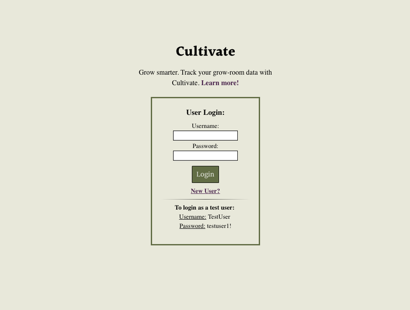
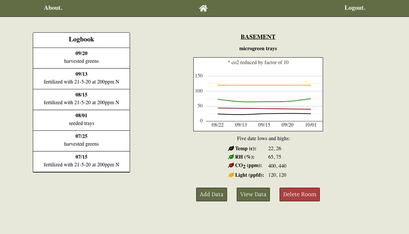

# Cultivate - Node Capstone
A data logging application to track the environmental factors important in plant and mushroom grow spaces.

## Working Prototype

View Live App here: [Cultivate](https://tsputzke-cultivate-app.now.sh)  
View Node working prototype here: [Cultivate - API](https://pure-castle-83890.herokuapp.com) 

## Summary
Cultivate is a grow-room tracking application designed to keep your plant and fungi data organized.

As a user you can create rooms which store data, including: temperature, RH, CO2, Light levels, and comments. Quickly view data in a line graph, as well as weekly highs and lows. 

## Designs

**Landing Page** 

**Grow-Room View Page** 

## Technical

Cultivate was built with: 

#### Front End

* HTML5
* CSS3
* JavaScript 
* React

#### Back End 

* Node.js 
* Express.js
* PostgreSQL
* Mocha and Chai for testing

## Node command lines
* npm install ==> install all node modules
* nodemon server.js ==> run node server
* npm test ==> run the tests

## React command lines
* npm install ==> install all node modules
* npm run build ==> build the react files in the "build" folder
* npm start ==> run react server on http://127.0.0.1:8080
* npm test ==> run the tests
